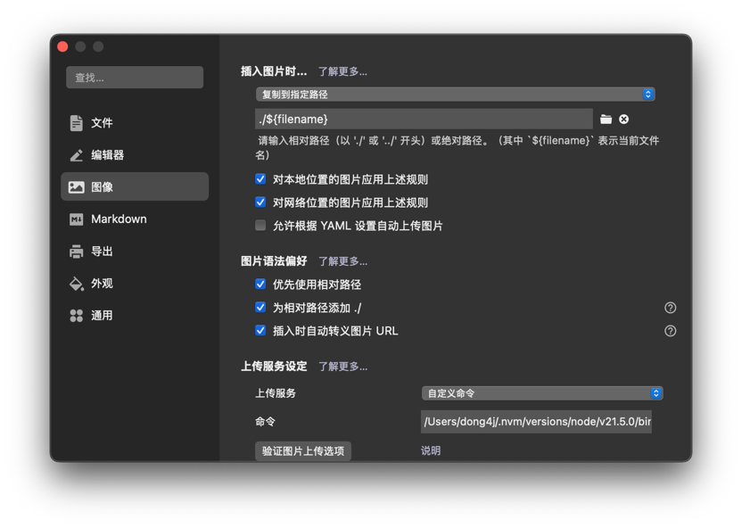
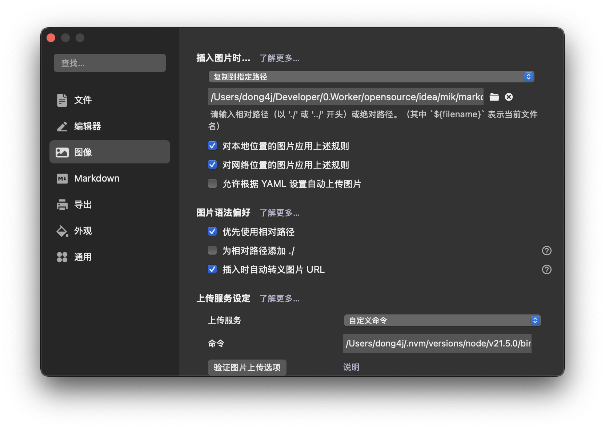
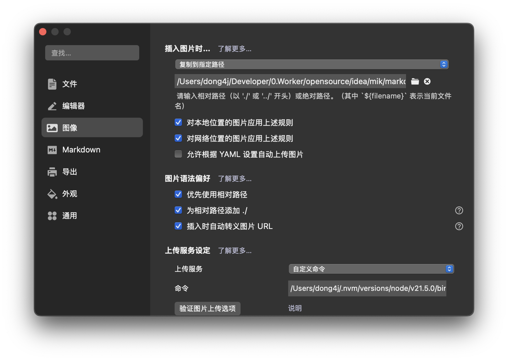
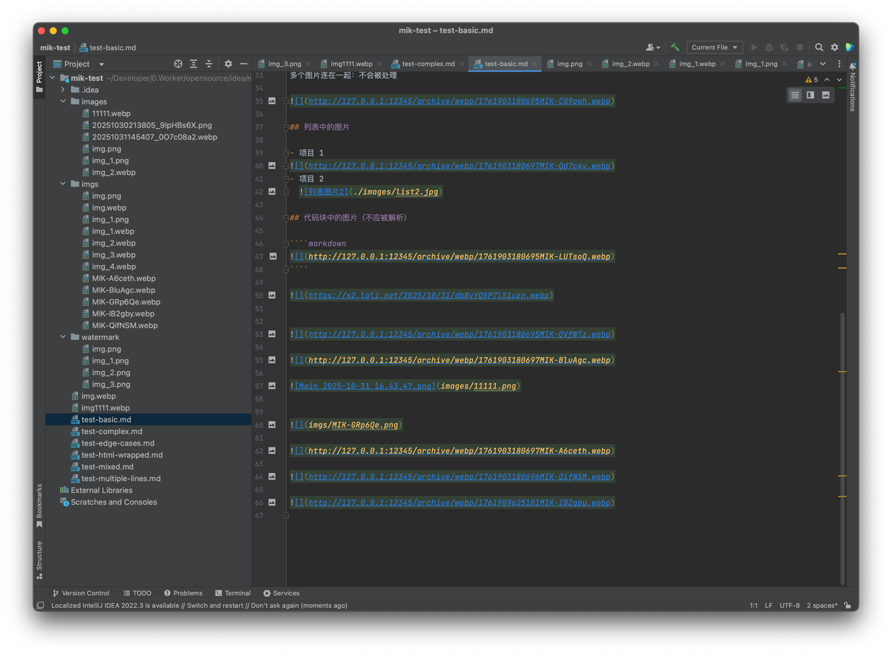
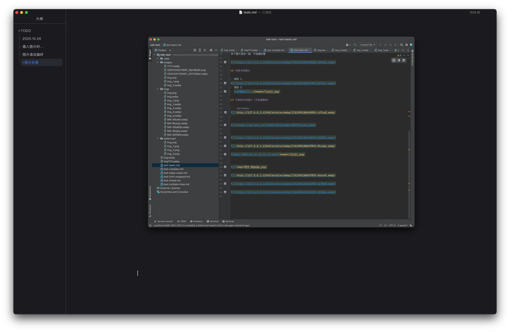

# TODO

## 2025.12.11

使用 code vision 快速处理图片:

1. 转换为 webp
2. 上传到图床
3. 迁移到其他图床
4. 替换为 `<a>` 标签
5. 添加水印
6. 下载到本地

## 2025.10.26

在收集了多个用户的需求后, 从 2.0.x 开始, 侧重于在 IDE 中处理图片, 就像 Typora 一样, 图片上传只是附带的一个增强功能而已, 所以会重构设置页面,
将图片处理放在首位, 然后是图片的增强处理, 比如图片压缩, 转为 webp, 添加水印等, 最后才是上传服务:



## 插入图片时...

**下拉选项**

1. 无特殊操作: 使用 IDE 原生操作

2. 复制图片到当前文件夹 (`./`): 现有逻辑可支持

3. 复制图片到 `./assets` 文件夹: 现有逻辑可支持

4. 复制图片到 `./${filename}.assets` 文件夹: 在现有逻辑中增加占位符解析

5. 上传图片: 直接从剪切板上传(现在的 **上传图片并替换**)

6. 复制到指定路径:

   自定义路径: 请输入相对路径（以：`./` 或 `../` 开头）或绝对路径。（其中 `${filename}` 表示当前文件名）

   需要支持 `${project}` 占位符, 用于保存到当前项目下的某个目录

---

**复选框:**

1. 对本地位置的图片应用上述规则
2. 对网络位置的图片应用上述规则: 在合法的 markdown 图片标签中, 如果粘贴的是网络图片, 则会直接下载到执行的目录中

## 图片语法偏好

优先使用相对路径


复制到绝对路径是, 在未开启 **优先使用相对路径** 时, 图片会是全路径格式:

```

```



开启 **优先使用相对路径** 时, 图片会是相对径格式:

```

```



开启 **优先使用相对路径** 且 开启 **为相对路径添加 `./`** 时, 会自动添加 `./`:

```

```

## 图片处理

1. 替换为 `<a>` 标签
    1. 正常
    2. 点击放大
    3. 自定义
2. 图片压缩
    1. 转为 WebP
3. 图片重命名
    1. 随机
    2. 文件名
    3. 时间戳+文件名
4. 添加水印

### 上传服务设定

1. 下拉列表选择服务商
2. 根据不同的服务商展示不同的输入框
3. 验证图片上传选项按钮: 发起上传测试请求
4. 帮助按钮

默认图床复选框: 如果配置多个服务商的话, 需要选择一个默认的服务商, 会在以下逻辑中使用:

1. `alt + enter`: `info.dong4j.idea.plugin.action.intention.ImageUploadIntentionAction`
2. 右键 **图片上传**:  `info.dong4j.idea.plugin.action.image.ImageUploadAction`


- [ ] 新特性
    - 图床迁移添加一个 迁移到本地的功能, 意思是将图床的图片下载到本地并替换为本地图片标签
      在图床迁移的下拉列表中,添加一个 本地存储 选项(保持为最后一个选项), 然后使用网络下载图片并替换标签(需要支持无图片后缀,
      有参数的网络图片[从响应中获取 content-type])
      可以将 本地存储 这个也作为一个 OSS 客户端, 可以兼容整个业务流程, 然后在本地存储的 OSS 客户端实现中, 将上传修改为下载即可,
      存储位置从设置页面读取(默认是 `./imgs`, 即当前 markdown 文件所在目录的 imgs 子目录中), 下载之后的文件名根据是否开启 图片重命名功能来生成
    - 支持 `file://` 协议的本地图片
    - 支持本地无后缀的图片, 那就需要通过获取文件的 magic code 来判断图片类型
    - 支持没有后缀的网络图片, 比如一些常见的添加了图片处理参数的 url(比如 `?x-0ss-process=image/resize,m_fixed,w_100,h_100`), 或图片 API
  - 图片重命名: 如果选择 `日期-文件名`, 则需要支持日期格式化, 比如 `${yyyy-mm-dd}-${number}-${filename}`; 选择随机的话也通过占位符来指定随机的字符和长度;
    - 支持 复制图片到项目根路径下的某个目录: `$(project_path)/static/imgs/${filename}` 意思是增强现在的复制图片的功能, 支持绝对路径 (如果
      IDE 支持的话)
    - 类 Typora 功能: 复制到指定目录: 输入相对路径(以 `./` 或 `../` 开头) 或绝对路径, `${filename}` 表示 markdown 文件名






